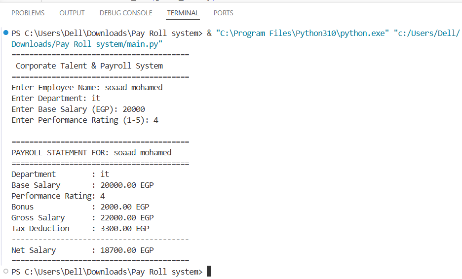

# Corporate Payroll System

A simple Python application that simulates a corporate HR and Payroll Management System. The program calculates employee bonuses, tax deductions, gross salary, and net salary based on performance ratings.

---

## Features

- Calculate employee bonus based on performance rating.
- Calculate tax deductions.
- Calculate gross salary.
- Calculate net salary.
- Validate user input.
- Display a formatted payroll statement.

---

## Technologies Used

- Python
- Functions
- Conditional Statements
- User Input Validation
- Formatted Output

---

## How to Run

1. Clone the repository:

```bash
git clone https://github.com/soad109/Pay-Roll-system.git
```

2. Navigate to the project folder:

```bash
cd Pay-Roll-system
```

3. Run the program:

```bash
python main.py
```

---

## Program Screenshot



---

## Project Structure

```
Pay-Roll-system
│── main.py
│── README.md
│── screenshot.png
```

---

## Author

**Soaad Mohamed**

